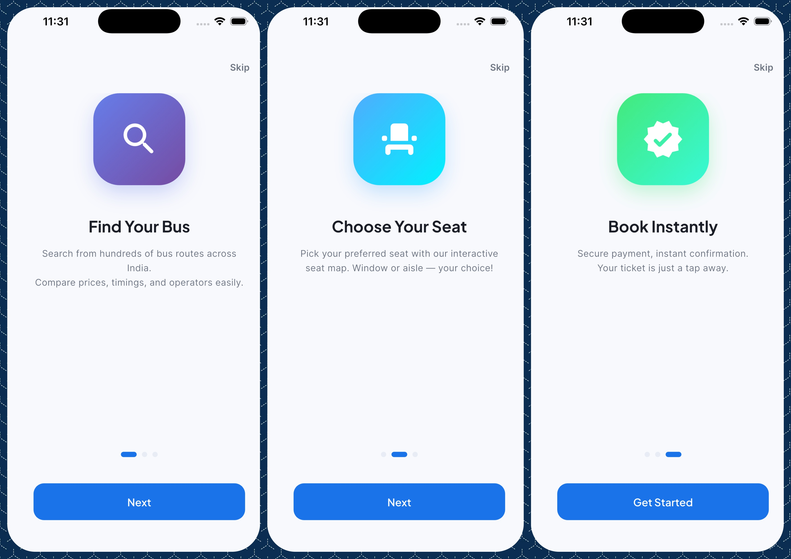
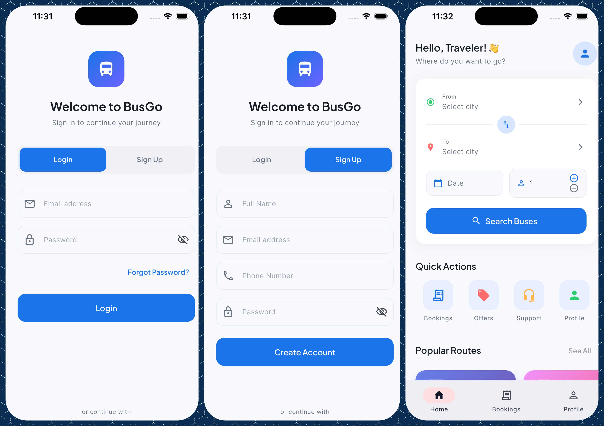
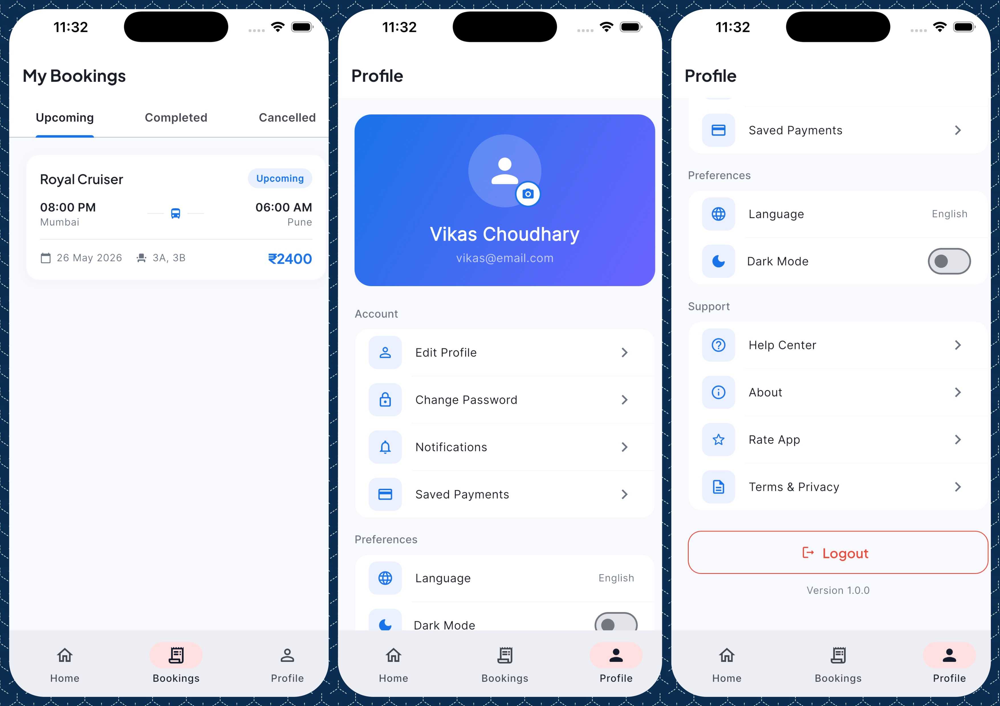
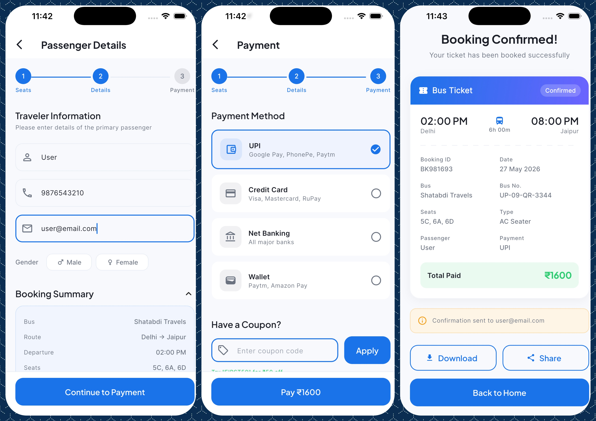
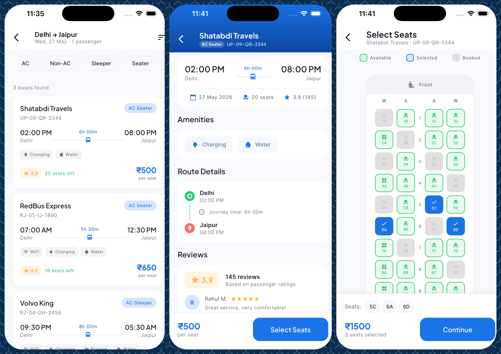
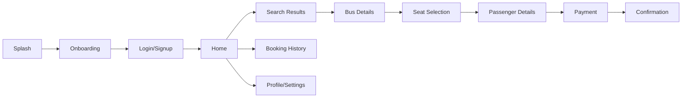

# BusGo 🚌

> A Premium Bus Reservation Application built with Flutter

[](https://flutter.dev/)
[](https://dart.dev/)
[](https://opensource.org/licenses/MIT)

## Overview

BusGo is a modern, responsive, and cross-platform frontend for a comprehensive bus reservation system. Designed with a focus on user experience and seamless booking flows, it allows users to search for buses, select seats, manage bookings, and handle payments smoothly. 

Whether you're building a commercial booking platform or a large-scale public transport app, BusGo provides a robust UI foundation.

## Features

- **Intuitive Bus Search**: Search for buses between cities with date filters.
- **Dynamic Seat Selection**: Visual and interactive seat layouts.
- **Booking Management**: View past, active, and cancelled bookings.
- **Passenger Details**: Secure form handling for passenger information.
- **Premium UI/UX**: Built with modern design principles, utilizing Shimmer loading effects and smooth page transitions.
- **State Management**: Scalable and predictable state handled via Provider.

## Screenshots

<div style="display: flex; flex-wrap: wrap; gap: 10px;">
  
  
  
  
  
</div>

## Tech Stack

- **Framework:** Flutter
- **Language:** Dart
- **State Management:** Provider
- **Fonts:** Google Fonts
- **UI Packages:** 
  - `smooth_page_indicator` (Onboarding/Sliders)
  - `shimmer` (Loading Skeletons)
- **Utilities:** `intl` (Date/Time formatting)

## Installation

### Prerequisites
- [Flutter SDK](https://flutter.dev/docs/get-started/install) (v3.10.4 or higher)
- [Dart SDK](https://dart.dev/get-dart)
- Android Studio / VS Code with Flutter plugins installed

### Setup

1. **Clone the repository**
   ```bash
   git clone https://github.com/alwaysvikaschoudhary/BusGo.git
   cd BusGo
   ```

2. **Install Dependencies**
   ```bash
   flutter pub get
   ```

3. **Run the App**
   ```bash
   flutter run
   ```

## Configuration

> **TODO:** Add environment variables documentation once the backend integration and `.env` files are fully configured.

- **API Base URL**: Currently hardcoded/mocked. Will be configurable via environment variables in future releases.

## Screen Flow



## Architecture & Project Structure

The application follows a clean, modular architecture utilizing the **Provider** pattern for state management. This separation of concerns ensures that the UI components are decoupled from the business logic and data layers.

### Core Layers

1. **Presentation Layer (`screens/`, `widgets/`)**:
   - Contains all the UI screens and reusable components.
   - Listens to Providers and reconstructs the UI when state changes.
   - Styled with consistent spacing, soft shadows, and Material 3 design systems.

2. **State Management Layer (`providers/`)**:
   - Bridge between the UI and mock data.
   - Handles global application state (like booking cart, theme status, passenger details).

3. **Data Layer (`models/`, `data/`)**:
   - Strongly-typed Dart models representing `Bus`, `Seat`, `Passenger`, `Booking`, etc.
   - Includes static rich mock data generator simulating API responses for all flows.

4. **Configuration & Design (`config/`)**:
   - App theme configuration (light and dark mode theme schemas), color system palettes, and navigation routes.

### Directory Tree

```text
lib/
├── main.dart                    # App entry, theme, routing
├── config/
│   ├── app_theme.dart           # Material 3 light & dark themes
│   ├── app_colors.dart          # Color palette
│   └── app_routes.dart          # Named route definitions
├── models/
│   ├── bus.dart                 # Enhanced Bus model
│   ├── seat.dart                # Seat model with enums
│   ├── passenger.dart           # Passenger model
│   ├── booking.dart             # Booking model
│   └── route_info.dart          # Route/city model
├── data/
│   └── mock_data.dart           # Rich mock data for all screens
├── screens/
│   ├── splash_screen.dart       # Animated splash
│   ├── onboarding_screen.dart   # 3-page onboarding
│   ├── login_screen.dart        # Login/signup with tabs
│   ├── home_screen.dart         # Search, featured routes, quick actions
│   ├── search_results_screen.dart # Bus list with filters
│   ├── bus_details_screen.dart  # Full bus info
│   ├── seat_selection_screen.dart # Visual seat layout
│   ├── passenger_details_screen.dart # Form with validation
│   ├── payment_screen.dart      # Payment method selection
│   ├── booking_confirmation_screen.dart # Success with ticket
│   ├── booking_history_screen.dart # Past bookings list
│   └── profile_screen.dart      # Settings & profile
├── widgets/
│   ├── common/
│   │   ├── app_button.dart      # Reusable CTA button
│   │   ├── app_card.dart        # Elevated card wrapper
│   │   ├── app_text_field.dart  # Styled text input
│   │   ├── loading_shimmer.dart # Skeleton loader
│   │   ├── empty_state.dart     # Empty state illustration
│   │   └── section_header.dart  # Section title + action
│   ├── home/
│   │   ├── search_card.dart     # Route search widget
│   │   ├── featured_route_card.dart # Popular route card
│   │   └── quick_action_chip.dart # Quick action buttons
│   ├── search/
│   │   ├── bus_card.dart        # Bus result card
│   │   └── filter_bar.dart      # Filter chips row
│   └── seat/
│       └── seat_widget.dart     # Individual seat tile
└── providers/
    └── app_provider.dart        # App-wide state management
```

## API Documentation

> **TODO:** Integrate comprehensive API documentation once the backend endpoints are finalized.

## Scripts

Use the following commands for development and testing:

| Command | Description |
|---|---|
| `flutter run` | Starts the app in debug mode |
| `flutter test` | Runs all unit and widget tests |
| `flutter analyze` | Runs Dart static analysis |
| `flutter build apk` | Builds a release APK for Android |
| `flutter build ios` | Builds a release IPA for iOS |

## Deployment

### Android
```bash
flutter build apk --release
# OR for App Bundle
flutter build appbundle --release
```

### iOS
```bash
flutter build ios --release
```
*Note: iOS deployment requires Xcode and a valid Apple Developer account.*

## Testing

To run the test suite:

```bash
flutter test
```
*Currently utilizes the default `flutter_test` framework.*

## Performance & Security

- **Optimization**: Implements Shimmer for non-blocking UI rendering during data fetches.
- **State**: Uses `Provider` efficiently to rebuild only necessary widget subtrees, ensuring 60fps scrolling and transitions.
- **Security**: *TODO: Detail token management and secure storage implementations.*

## Troubleshooting

- **Issue:** `flutter pub get` fails or gets stuck.
  - **Fix:** Run `flutter clean` then try `flutter pub get` again.
- **Issue:** iOS build fails with Cocoapods error.
  - **Fix:** Navigate to the `ios` directory, run `pod repo update` and then `pod install`.

## Roadmap

- [ ] Integrate live backend APIs
- [ ] Add Payment Gateway (Stripe/Razorpay) integration
- [ ] Implement Push Notifications for booking updates
- [ ] Add multi-language support (i18n)
- [ ] Dark Mode support

## Contributing

1. Fork the Project
2. Create your Feature Branch (`git checkout -b feature/AmazingFeature`)
3. Commit your Changes (`git commit -m 'Add some AmazingFeature'`)
4. Push to the Branch (`git push origin feature/AmazingFeature`)
5. Open a Pull Request

## License

Distributed under the MIT License. See `LICENSE` for more information.

## Contact

Maintainer: Vikas Choudhary - [@alwaysvikaschoudhary](https://github.com/alwaysvikaschoudhary)
